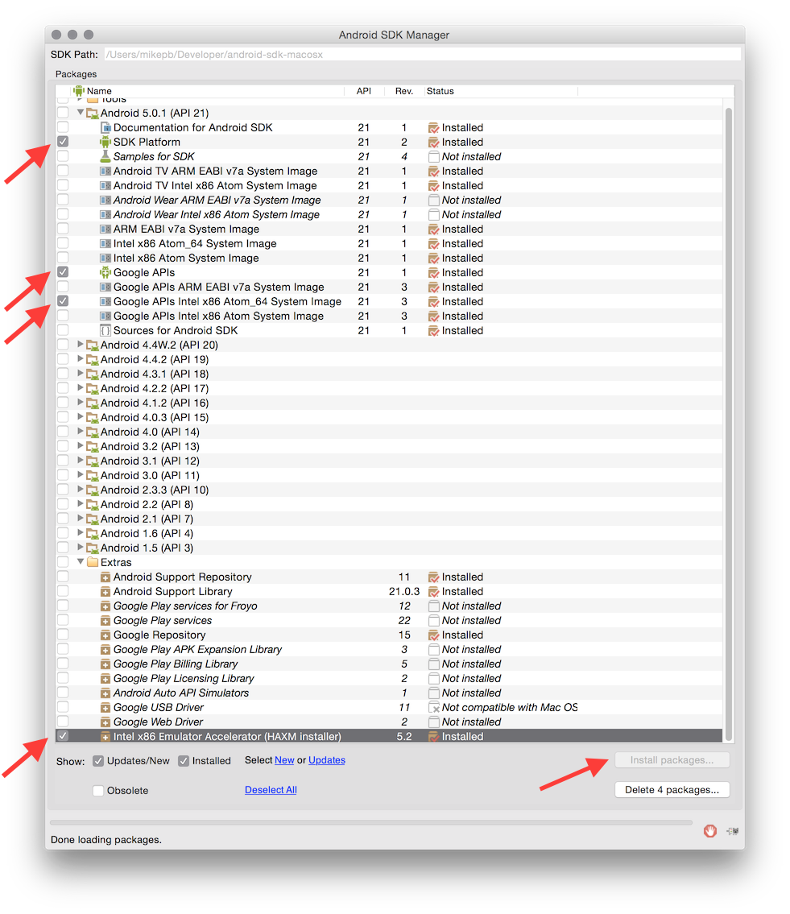
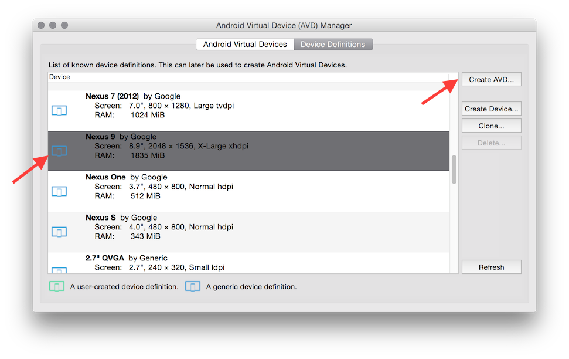
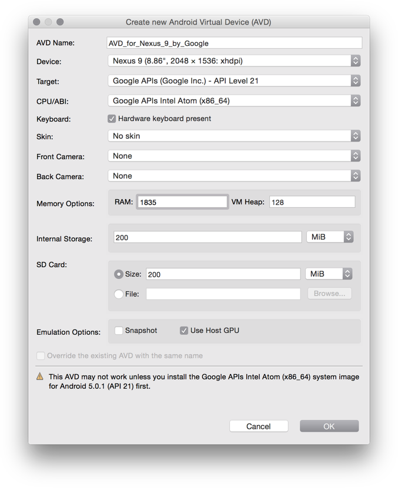
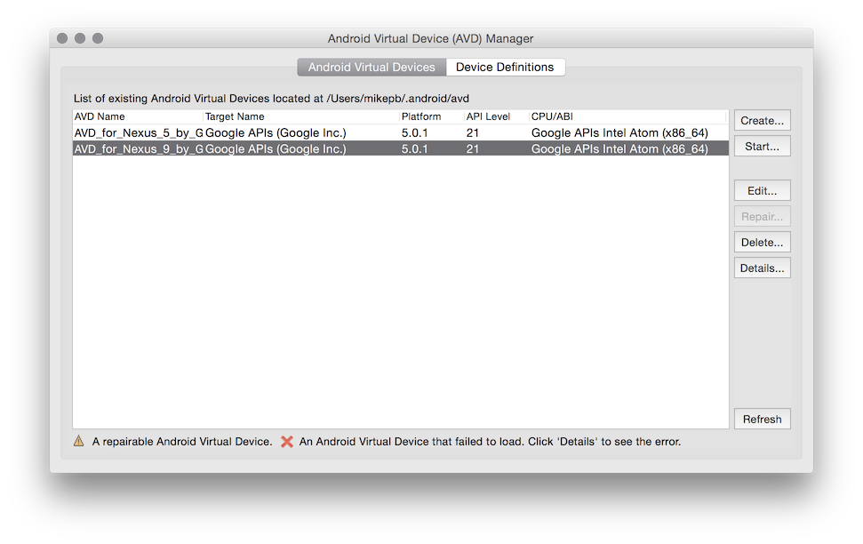
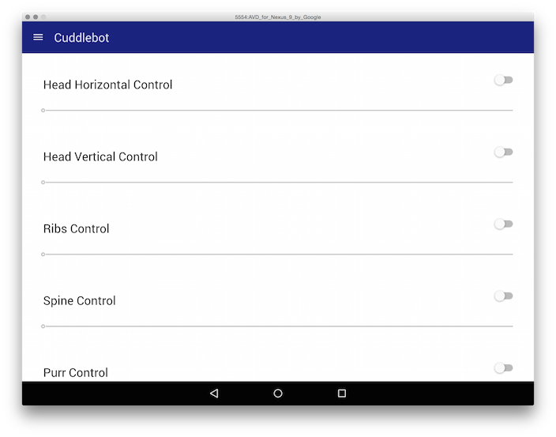

# Android Getting Started Guide

This guide assumes you are developing on OS X. Please adjust the
instructions as necessary for your development platform.

To run the app using the Android simulator, you will need to install the
[Android SDK][sdk]. Either the SDK as bundled with Android Studio or the
standalone SDK will work. Make a note of where the SDK is located. You may
export the location as `ANDROID_HOME`, for example:

```sh
$ export ANDROID_HOME=$HOME/Developer/android-sdk-macosx
```

Next, you will need to configure an emulator with Android 5.0 Lollipop.
Install the necessary software using the Android SDK Manager, which may be
started using the command line:

```sh
$ $ANDROID_HOME/tools/android
```

Choose the following packages to install, if they are not already installed:

- Android 5.0.1 (API 21)
    + SDK Platform
    + Google APIs
    + Google APIs Intel x86 Atom_64 System Image
- Extras
    + Intel x86 Emulator Accelerator (HAXM installer)

Click "Install packages..." to install the packages.



Once the installation completes, install the Intel x86 Emulator Accelerator.
The installer may be found at:

```sh
$ $ANDROID_HOME/extras/intel/Hardware_Accelerated_Execution_Manager/
```

Now configure an emulator using the Android Virtual Devices Manager. The
AVD manager may be opened using the command:

```sh
$ $ANDROID_HOME/tools/android avd
```

Open the "Device Definitions" tab, choose "Nexus 9 by Google" from the list
and click the "Create AVD..." button to create an AVD.



In the dialog that opens, ensure the settings the following settings are
set:

- Device: Nexus 9 (8.86", 2048 x 1536: xhdpi)
- Target: Google APIs (Google Inc.) - API Level 21
- CPU/ABI: Google APIs Intel Atom (x86_64)
- Skin: No skin
- SD Card: Size 200 MiB
- Emulation Options: Use Host GPU checked

You may leave other options at their default values. Click "OK" to create
the device.



You have just created an AVD running Android 5.0 Lollipop x86_64. You may
select the AVD and click "Start..." to ensure that it runs.



Afterwards, install [NodeJS][nodejs] and then you will be able to install
Cordova:

```sh
$ npm install -g cordova
```

Remember to set `ANDROID_HOME` before starting the emulator. If you have
other AVDs configured, use the `--target` option to select an AVD running
Lollipop.

```sh
$ export ANDROID_HOME=$HOME/Developer/android-sdk-macosx
$ cordova emulate --target=AVD_for_Nexus_9_by_Google android
```



For more Android deployment options, please see the Cordova Android Platform
Guide:

http://cordova.apache.org/docs/en/4.0.0/guide_platforms_android_index.md.html


## Android time input bug

Android Lollipop currently has a bug in the HTML5 time picker dialog. The
dialog is missing an "OK" button to set the time. The time picker appears
to be working in previous versions of Android. For more information, see:

http://stackoverflow.com/questions/27245813/cordova-phonegap-android-5-time-picker-missing-set-button-cancel-and-clear-butto

[devguide]: development.md
[nodejs]: http://nodejs.org
[sdk]: https://developer.android.com/sdk/installing/index.html
